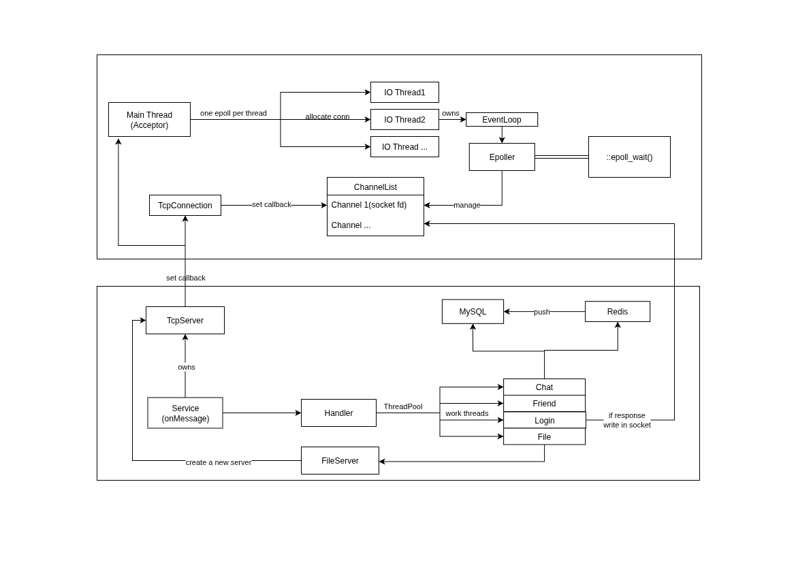
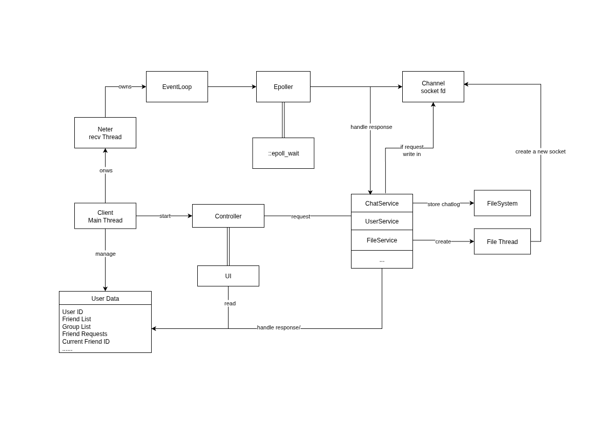

## 架构

### 服务端架构



网络IO(主从Reactor模式)

主reactor(Main Thread Acceptor):专注于通过epoll处理accept事件并接入新连接，并将新的连接分配给子reactor(IO Thread)  (轮询算法)

从reactor(IO Thread Pool):每个IO线程独立拥有Epoller和EventLoop,通过::epoll_wait()监听已经注册的Channel事件，非阻塞IO处理，每个连接对应一个TcpConnection对象,并与Channel(fd)绑定


业务逻辑

TcpServer设置onMessage回调，将接收到的数据传递给业务层请求分发Handler，各个业务类都是Handler的子类(继承Handler)，通过设置的路由组件将不同的任务类型派发到对应的函数

Work线程池与IO线程解耦，将耗时的业务逻辑操作(对数据库的增删改查操作)派发到work threads，避免阻塞网络IO。文件传输重型业务独立部署FileServer，使用::sendfile()提高传输效率


数据存储

使用MySQL做持久化存储(账户信息等)，Redis存储需要频繁查询的数据(是否为好友关系，是否在线等)，另外，大量消息并发时将Redis作为中间缓存，而后定时一次性插入MySQL中，提高并发响应速度，避免频繁写入MySQL

### 客户端架构



网络IO与文件传输移交独立线程，使主线程零阻塞与用户交互

FileThread与网络线程分离，防止大文件影响正常通信

网络线程在单连接情况下使用epoll事件驱动提高CPU的使用效率

文件操作、网络通信、用户服务、用户交互  相互分离（单一职责）

## 如何构建

<!-- 

> docker run 最后的参数是服务端的Ip地址。
如用容器启动并传文件:  
1.把文件托进/tmp/chatclient中。
2.使用/tmp/chatclient为父目录传输文件，如:/tmp/chatclient/文件名

```bash
docker pull zbchi/chatroomcli
docker run -it -v /tmp/chatclient:/tmp/chatclient zbchi/chatroomcli 10.30.1.235
```

------ -->

## 客户端编译安装

#### 1. 拉取仓库

```bash
git clone https://github.com/zbchi/WeeeChatroom.git
```

#### 2. 安装依赖

> 客户端依赖 [`nlohmann/json`](https://github.com/nlohmann/json) 用于解析与构建 JSON 数据。

##### Ubuntu / Debian：

```bash
sudo apt update
sudo apt install nlohmann-json3-dev

sudo apt install libreadline-dev

```

##### Arch / Manjaro：

```bash
sudo pacman -S nlohmann-json

sudo pacman -S readline
```

#### 3. 编译项目

```bash
cd WeeeChatroom
cmake -Bbuild -S. -DO=ON
cd build
make -j
```

#### 4. 运行客户端

假设服务端 IP 为 `10.30.1.235`，可以使用以下命令连接服务端：

```bash
./client/chat_client 10.30.1.235
```

> 下载的文件存储在目录:/tmp/chatclient/chat_files 中

## 服务端安装

### docker安装

```bash
git clone https://github.com/zbchi/WeeeChatroom.git
cd Weeechatroom
docker compose up
```

### 编译安装

#### 1.安装依赖

```bash
#安装Json
sudo apt update
sudo apt install nlohmann-json3-dev

#安装并启动Redisls
sudo apt update
sudo apt install redis -y
sudo systemctl start redis

#安装MySQL
sudo apt install -y mysql-server mysql-client

#安装hiredis库
git clone https://github.com/redis/hiredis.git
cd hiredis
make -j
sudo make install

#安装redis++库
git clone https://github.com/sewenew/redis-plus-plus.git
cd redis-plus-plus
mkdir build && cd build
cmake .. -DCMAKE_BUILD_TYPE=Release
make -j
sudo make install

#安装MySQL开发库
sudo apt install libmysqlclient-dev

#安装libcurl和libcurl-dev
sudo apt install -y libcurl4-openssl-dev

#安装libuuid
sudo apt-get install uuid-dev

```

#### 2.拉取仓库

``` bash
git clone https://github.com/zbchi/WeeeChatroom.git
```

#### 3.初始化数据库

```bash
cd WeeeChatroom
sudo mysql < init.sql
```

#### 4.编译并运行

``` bash
mkdir build 
cd build 
cmake ..
make -j
./server/chat_server
```

## 目录结构

``` bash
server/
├── base/
│   ├── include/
│   │   ├── base.h
│   │   ├── MySQLConn.h
│   │   └── Redis.h
│   ├── base.cc
│   ├── MySQLConn.cc
│   ├── Redis.cc
│   └── CMakeLists.txt
├── handler/
│   ├── include/
│   │   ├── Chat.h
│   │   ├── File.h
│   │   ├── Friend.h
│   │   ├── Group.h
│   │   ├── Handler.h
│   │   ├── Login.h
│   │   └── Register.h
│   ├── Chat.cc
│   ├── File.cc
│   ├── Friend.cc
│   ├── Group.cc
│   ├── Login.cc
│   ├── Register.cc
│   └── CMakeLists.txt
├── main.cc
├── Service.cc
├── Service.h
└── CMakeLists.txt

client/
├── include/
│   ├── base.h
│   ├── Client.h
│   ├── Controller.h
│   ├── Neter.h
│   └── ui.h
├── service/
│   ├── include/
│   │   ├── ChatService.h
│   │   ├── FileService.h
│   │   ├── FriendService.h
│   │   ├── GroupService.h
│   │   └── UserService.h
│   ├── ChatService.cc
│   ├── FileService.cc
│   ├── FriendService.cc
│   ├── GroupService.cc
│   ├── UserService.cc
│   └── CMakeLists.txt
├── Client.cc
├── Controller.cc
├── Neter.cc
├── ui.cc
├── main.cc
└── CMakeLists.txt

netlib/
├── base/
│   ├── CurrentThread.cc
│   ├── CurrentThread.h
│   ├── Logger.cc
│   ├── Logger.h
│   ├── ThreadPool.cc
│   ├── ThreadPool.h
│   ├── Timestamp.cc
│   └── Timestamp.h
├── reactor/
│   ├── Acceptor.cc
│   ├── Acceptor.h
│   ├── Buffer.cc
│   ├── Buffer.h
│   ├── Channel.cc
│   ├── Channel.h
│   ├── Connector.cc
│   ├── Connector.h
│   ├── Epoller.cc
│   ├── Epoller.h
│   ├── EventLoop.cc
│   ├── EventLoop.h
│   ├── EventLoopThread.cc
│   ├── EventLoopThread.h
│   ├── EventLoopThreadPool.cc
│   ├── EventLoopThreadPool.h
│   ├── InetAddress.cc
│   ├── InetAddress.h
│   ├── Poller.cc
│   ├── Poller.h
│   ├── Sendfile.h
│   ├── Socket.cc
│   ├── Socket.h
│   ├── SocketsOps.cc
│   ├── SocketsOps.h
│   ├── TcpClient.cc
│   ├── TcpClient.h
│   ├── TcpConnection.cc
│   ├── TcpConnection.h
│   ├── TcpServer.cc
│   ├── TcpServer.h
│   ├── TimerQueue.cc
│   └── TimerQueue.h
└── CMakeLists.txt

12 directories, 89 files
```

